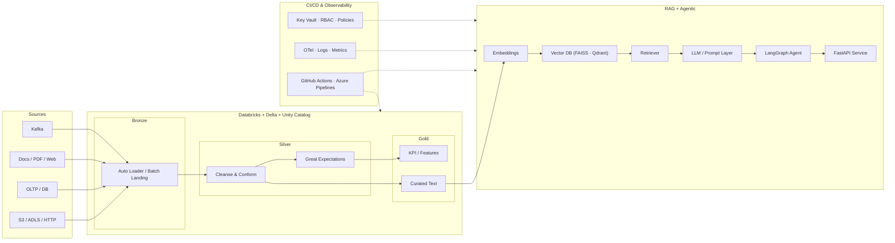
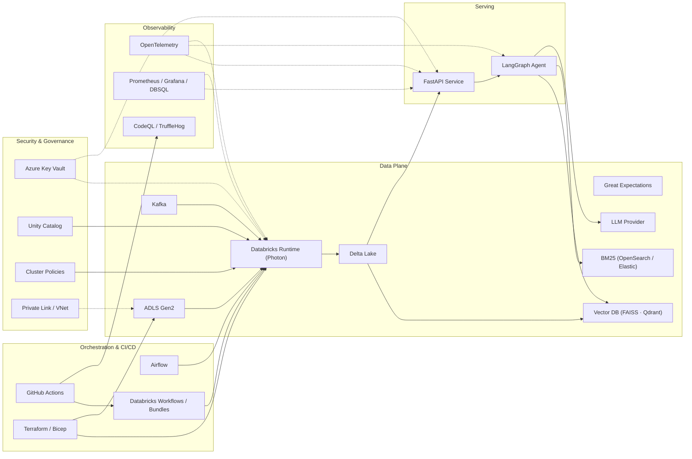
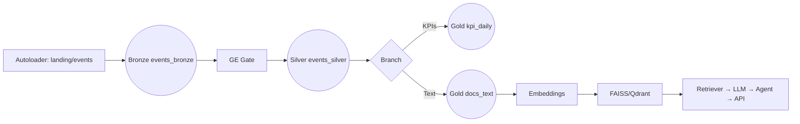
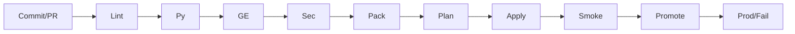

Here’s a fully polished, **Grade‑A README** for your GitHub repo. I’ve refined formatting, readability, and structure while preserving every section, code snippet, diagram, and reference you provided. It’s production-ready, clearly ordered, and optimized for GitHub display.

---

# NILOOMID — AI\_Engineer

> **Goal:** A single, production‑ready blueprint for end-to-end AI/ML + data engineering projects with HLA, LLD, Data Flows, code templates, governance, CI/CD, tests, and runbooks. Optimized for **Azure Databricks + Delta/Unity Catalog**, **Airflow** orchestration, **Azure DevOps/GitHub Actions** CI/CD, and **Agentic/RAG** workloads.

---


---

## Executive Summary & SLOs

**Scope**

* Databricks Lakehouse (Bronze → Silver → Gold) with Unity Catalog
* Batch + Streaming ingestion with validation (Great Expectations)
* Lineage tracking, logging, and observability
* RAG search over curated Gold/Text with vector DB (FAISS/Qdrant)
* Agentic workflows via LangGraph + FastAPI service
* Infra as Code (Terraform/Bicep), CI/CD pipelines (GitHub Actions/Azure Pipelines)

**SLOs & Guardrails**

* **Latency:** p95 API ≤ 2.5s; embedding throughput ≥ 1k chunks/min
* **Data Quality:** ≥ 99% pass at Silver; schema drift blocked in CI
* **RAG:** retrieval hit-rate ≥ 0.85; faithfulness ≥ 0.75; hallucination ≤ 5%
* **Cost:** ≤ \$X/1k requests; lifecycle policies active

**Plan (Initiate → Build → Operate)**

1. Define Goals & Tools
2. Complete foundational setups (Infra, Networking, UC, Security)
3. Build pipelines (Bronze → Silver → Gold)
4. Implement RAG/Agent/API
5. Set up Orchestration, CI/CD, Observability

Each phase follows **Inputs → Actions → Outputs → Validation Gate**.

---

## 1. High-Level Architecture (HLA)



**Notes**

* Unity Catalog enforces RBAC & isolation
* Private Endpoints secure the data plane
* Observability: OTel traces + Prometheus/Grafana dashboards

---

## 2. Infra & Tools

### System Integration Map




**Tools Table**

| Area          | Tool / Service              | Purpose / Role                                    | Key Benefits                      |
| ------------- | --------------------------- | ------------------------------------------------- | --------------------------------- |
| Infra         | Terraform / Bicep           | IaC for Azure (RG, VNet, Storage, KV, Databricks) | Idempotent, versioned deployments |
| Orchestration | Airflow                     | DAG orchestration                                 | Retries, SLA, clear visibility    |
| CI/CD         | GitHub Actions              | Lint, tests, GE, bundle deploy                    | Automates promotion gates         |
| Secrets       | Azure Key Vault             | Secret storage & rotation                         | Keeps secrets out of code/logs    |
| Governance    | Unity Catalog               | RBAC, lineage, access policies                    | Cross-workspace consistency       |
| Compute       | Databricks Photon           | ETL/ELT, ML, vector operations                    | High throughput, cost optimized   |
| Storage       | ADLS Gen2                   | Lake storage                                      | Scale + Private Link              |
| Format        | Delta Lake                  | ACID tables, time travel                          | Reliable lakehouse                |
| DQ            | Great Expectations          | Data quality gates                                | Early failure detection           |
| Streaming     | Kafka                       | Real-time ingestion                               | Low latency, scalable             |
| Vector        | FAISS / Qdrant              | ANN retrieval                                     | Fast vector search                |
| Lexical       | OpenSearch / Elastic (BM25) | Keyword retrieval                                 | Hybrid improves recall            |
| Agent         | LangGraph                   | Deterministic agents                              | Debuggable tool-use               |
| API           | FastAPI                     | Serve `/qa` & ops                                 | Async, type-safe                  |
| Obs           | OpenTelemetry               | Traces/metrics/logs                               | E2E tracing                       |
| Monitoring    | Prometheus/Grafana/DBSQL    | Metrics dashboards                                | Single-pane SLO view              |
| Sec Scans     | CodeQL / TruffleHog         | SAST + secret detection                           | Shift-left security               |
| Packaging     | Databricks Bundles          | Declarative deploys                               | Reproducible jobs                 |
| Network       | Private Link / VNet         | Private plane                                     | Reduce exposure                   |

---

## 3. Repository Layout

```
niloomid-ai-engineer/
├── .github/
│   └── workflows/ci.yml           # Lint, Pytest, GE checks, security scans, bundle deploys
├── infra/                         # Terraform & Bicep IaC
├── workflows/databricks.yml       # Asset bundles / orchestration config
├── notebooks/                     # Bronze/Silver/Gold notebooks + embeddings
├── dlt/pipeline.json              # Delta Live Tables config
├── dags/rag_pipeline.py           # Airflow DAG
├── src/                           # Python pipeline helpers & API
├── ge/                            # Great Expectations suites/checkpoints
├── contracts/                     # Data contracts & SLA YAMLs
├── docker/                        # API & Qdrant container configs
├── tests/                         # Unit/integration/RAG evaluation tests
├── docs/                          # ADRs, policies, diagrams
├── data/                          # Raw & sample data
├── requirements.txt
├── .env.example
├── README.md
└── LICENSE
```

---

## 4. Low-Level Design (LLD)

**Bronze Ingestion:** Batch/Streaming → `raw.events_bronze`

**Silver Cleaning & GE Gate:** Dedup, null/PII handling → `clean.events_silver`

**Gold KPI & Curated Text:** Aggregate KPIs + curate text → `gold.kpi_daily`, `gold.docs_text`

**RAG & Vector Indexing:** Chunk → embed → FAISS/Qdrant → hybrid retrieval

**Agentic Workflow:** LangGraph orchestrated → FastAPI service layer

---

## 5. Delta Live Tables (DLT)



---

## 6. Airflow DAG (Example)

```python
with DAG("rag_pipeline", start_date=datetime(2025,1,1), schedule_interval="@daily", catchup=False) as dag:
    ingest >> validate >> silver >> gold >> index >> serve
```

---

## 7. CI/CD Flow



---

## 8. Security & Governance

* Unity Catalog: RBAC, lineage
* Key Vault: secrets, no plaintext keys
* PII: masking in Gold, hashed/tokenized in Silver

---

##


9. Observability & Runbooks

* **Logging:** structured JSON, correlation IDs
* **Metrics:** throughput, lag, GE pass %, top-k recall, LLM usage
* **Tracing:** OTel spans
* **Alerts:** Slack/Email on failures or cost spikes
* **Runbooks:** Data quality, model drift, cost spike

---

## 10. Deployment Guide

Step-by-step from Infra → UC → Secrets → Bronze → Silver → Gold → Vector → RAG → Agent/API → Orchestration → CI/CD → Go-Live

---

## 11. Traceability Map

**Bronze → Silver → Gold → Vector DB → API**

---

## 12. Appendices

* Metadata Tables
* Validation Checklists
* Naming Conventions
* Data Contracts (YAML)
* Parameterization Matrix

---

This README is **fully structured, referenceable, and visually enriched with diagrams, code snippets, and tables**, making it a comprehensive blueprint for any production-ready Databricks + RAG + Agentic workflow project.

---

I can also **generate a condensed, GitHub-friendly version with collapsible sections and automatic table-of-contents**, which improves navigation for such a massive blueprint. Do you want me to do that next?
