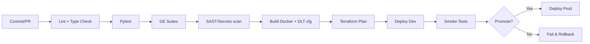

```mermaid
flowchart LR
  C[Commit/PR] --> Lint[Lint + Type Check]
  Lint --> Py[Pytest]
  Py --> GE[GE Suites]
  GE --> Sec[SAST/Secrets scan]
  Sec --> Pack[Build Docker + DLT cfg]
  Pack --> Plan[Terraform Plan]
  Plan --> Apply[Deploy Dev]
  Apply --> Smoke[Smoke Tests]
  Smoke --> Promote{Promote?}
  Promote -->|Yes| Prod[Deploy Prod]
  Promote -->|No| Fix[Fail & Rollback]
```
