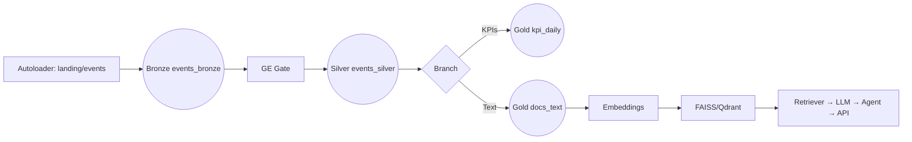

```mermaid
flowchart LR
  A[Autoloader: landing/events] --> B((Bronze events_bronze))
  B --> C[GE Gate]
  C --> D((Silver events_silver))
  D --> E{Branch}
  E -->|KPIs| F((Gold kpi_daily))
  E -->|Text| G((Gold docs_text))
  G --> H[Embeddings]
  H --> I[FAISS/Qdrant]
  I --> J[Retriever → LLM → Agent → API]
```
