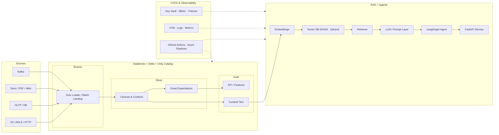

```mermaid
flowchart LR
  %% --- Sources ---
  subgraph Sources
    s3["S3 / ADLS / HTTP"]
    db["OLTP / DB"]
    docs["Docs / PDF / Web"]
    kafka["Kafka"]
  end

  %% --- Lakehouse ---
  subgraph Lakehouse["Databricks + Delta + Unity Catalog"]
    subgraph Bronze["Bronze"]
      auto["Auto Loader / Batch Landing"]
    end
    subgraph Silver["Silver"]
      clean["Cleanse & Conform"]
      dq["Great Expectations"]
    end
    subgraph Gold["Gold"]
      kpi["KPI / Features"]
      text["Curated Text"]
    end
  end

  %% --- AI / Agentic ---
  subgraph AI["RAG + Agentic"]
    embed["Embeddings"]
    vdb["Vector DB (FAISS · Qdrant)"]
    retr["Retriever"]
    llm["LLM / Prompt Layer"]
    agent["LangGraph Agent"]
    api["FastAPI Service"]
  end

  %% --- Ops ---
  subgraph Ops["CI/CD & Observability"]
    ci["GitHub Actions · Azure Pipelines"]
    mon["OTel · Logs · Metrics"]
    sec["Key Vault · RBAC · Policies"]
  end

  %% --- Edges ---
  s3 --> auto
  db --> auto
  docs --> auto
  kafka --> auto

  auto --> clean --> dq --> kpi
  clean --> text

  text --> embed --> vdb --> retr --> llm --> agent --> api

  ci -.-> Lakehouse
  ci -.-> AI
  mon -.-> AI
  sec -.-> AI
```
