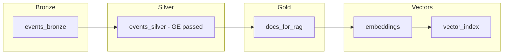

```mermaid
flowchart LR
  %% left-to-right, quoted labels, no parentheses

  subgraph "Bronze"
    B["events_bronze"]
  end

  subgraph "Silver"
    S["events_silver - GE passed"]
  end

  subgraph "Gold"
    G["docs_for_rag"]
  end

  subgraph "Vectors"
    E["embeddings"]
    X["vector_index"]
  end

  B --> S --> G --> E --> X
```
