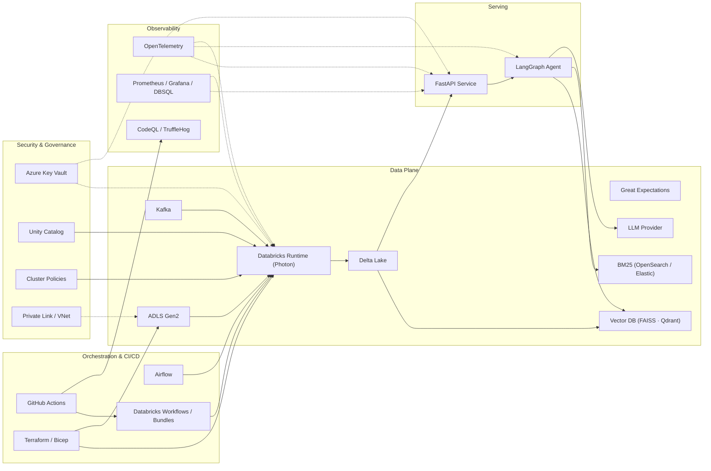

```mermaid
flowchart LR
  subgraph ORCH["Orchestration & CI/CD"]
    gh["GitHub Actions"]
    af["Airflow"]
    dab["Databricks Workflows / Bundles"]
    tf["Terraform / Bicep"]
  end
  subgraph SEC["Security & Governance"]
    kv["Azure Key Vault"]
    uc["Unity Catalog"]
    pol["Cluster Policies"]
    plink["Private Link / VNet"]
  end
  subgraph DATA["Data Plane"]
    adls["ADLS Gen2"]
    dbx["Databricks Runtime (Photon)"]
    delta["Delta Lake"]
    ge["Great Expectations"]
    kafka["Kafka"]
    vdb["Vector DB (FAISS · Qdrant)"]
    search["BM25 (OpenSearch / Elastic)"]
    llm["LLM Provider"]
  end
  subgraph SRV["Serving"]
    agent["LangGraph Agent"]
    api["FastAPI Service"]
  end
  subgraph OBS["Observability"]
    otel["OpenTelemetry"]
    graf["Prometheus / Grafana / DBSQL"]
    secscan["CodeQL / TruffleHog"]
  end
  tf --> dbx
  tf --> adls
  gh --> dab
  gh --> secscan
  af --> dbx
  dab --> dbx
  kv -.-> dbx
  kv -.-> api
  uc --> dbx
  plink -.-> adls
  pol --> dbx
  adls --> dbx
  kafka --> dbx
  dbx --> delta
  delta --> vdb
  delta --> api
  agent --> vdb
  agent --> search
  api --> agent
  agent --> llm
  otel -.-> api
  otel -.-> agent
  otel -.-> dbx
  graf -.-> api
  graf -.-> dbx
```
