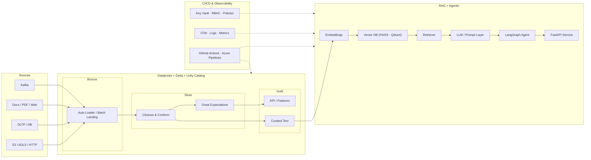
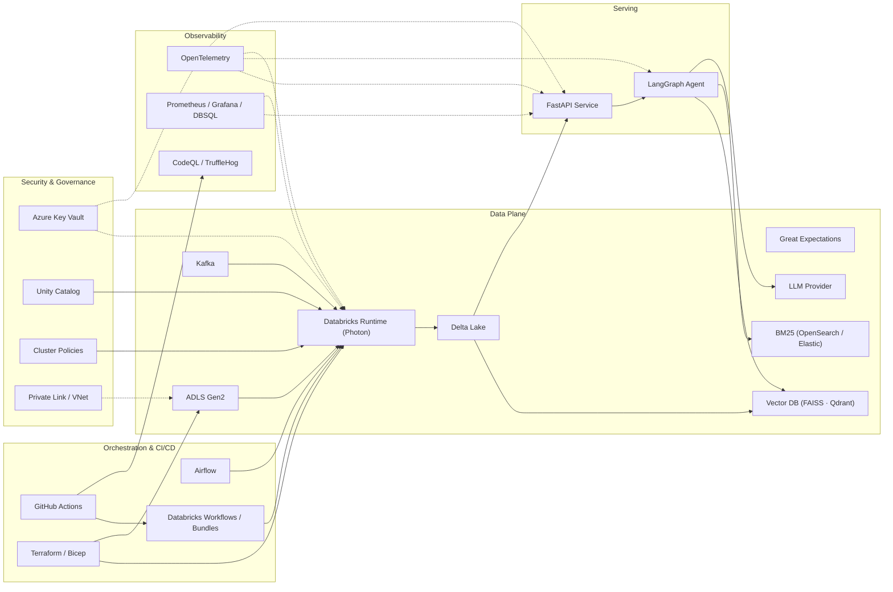
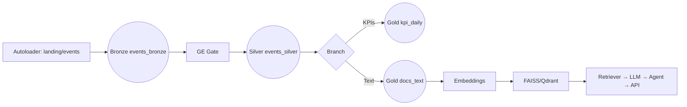
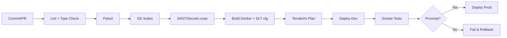
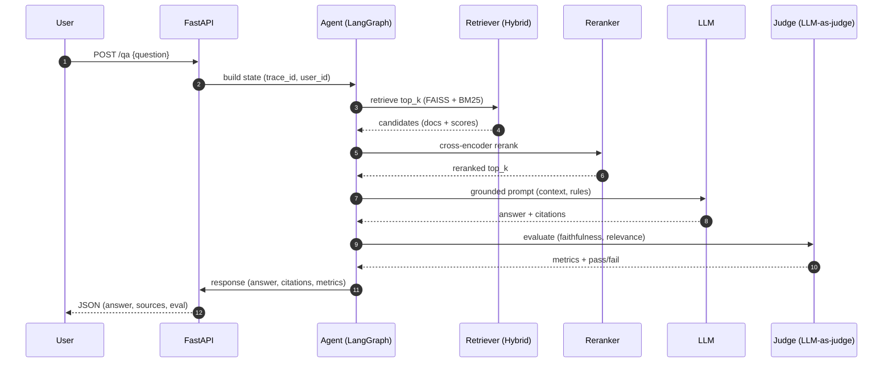

# NILOOMID — AI\_Engineer

> **Goal:** A single, production‑ready blueprint, end‑to‑end project with HLA, LLD, Data Flows, code templates, governance, CI/CD, tests, and runbooks. Optimized for **Azure Databricks + Delta/Unity Catalog**, **Airflow** orchestration, **Azure DevOps/GitHub Actions** CI/CD, and **Agentic/RAG** workloads.

---


## Executive Summary & SLOs

**Scope**

* Data lakehouse (Bronze → Silver → Gold) on Databricks/Delta (Unity Catalog enabled)
* Batch + Streaming ingestion, validation (Great Expectations), lineage, logging
* RAG search over curated text (Gold/Text) with vector DB (FAISS/Qdrant)
* Agentic workflows (LangGraph) + FastAPI service layer + Observability
* Infra as Code (Terraform/Bicep), CI/CD (GitHub Actions/Azure Pipelines)

**SLOs & Guardrails**

* p95 API latency ≤ 2.5s; embedding throughput ≥ 1k chunks/min (autoscale)
* DQ pass rate ≥ 99% at Silver gates; schema drift blocked by CI
* RAG: retrieval hit‑rate ≥ 0.85; faithfulness ≥ 0.75; hallucination ≤ 5%
* Cost budget: ≤ \$X/1k requests; storage lifecycle policies active


**Plan (Initiate → Build → Operate)**

Start with Goals, publish a tools map + HLA, then complete foundational setups (infra, networking, Unity Catalog, security). After that, build ingestion, Silver/Gold pipelines, RAG/Agent/API, orchestration, CI/CD, and SRE observability.
Each phase follows: Inputs → Actions → Outputs → Validation Gate.

---
## 1) High‑Level Architecture (HLA)



**Notes**

- Unity Catalog enforces RBAC & isolation.

- Private Endpoints secure data plane.

- Observability: OTel traces + Prometheus/Grafana dashboards.


## 2. Infra & Tools

### System Integrations

**HLA — System Integration Map**




**Tools Table — Purpose, Reasons, Benefits**

| Area          | Tool / Service                 | Purpose / Role                                    | Why This Choice                                 | Key Benefits                        | Notes / Alternatives             |
| ------------- | ------------------------------ | ------------------------------------------------- | ----------------------------------------------- | ----------------------------------- | -------------------------------- |
| Infra         | Terraform / Bicep              | IaC for Azure (RG, VNet, Storage, KV, Databricks) | Reproducible, reviewable infra; drift detection | Idempotent deploys, versioned state | Pulumi/Terragrunt optional       |
| Orchestration | Airflow                        | Batch/seq control of Databricks jobs              | Mature scheduler, DBX provider                  | Clear DAGs, retries, SLA alerts     | DBX Workflows for simpler graphs |
| CI/CD         | GitHub Actions                 | Lint, tests, GE, scans, Bundles deploy            | Native to GitHub                                | Automates gates & promotions        | Azure Pipelines also fits        |
| Secrets       | Azure Key Vault (+ DBX scopes) | Secret storage & rotation                         | Managed HSM, RBAC                               | Keeps secrets out of code/logs      | KV‑backed DBX scopes             |
| Governance    | Unity Catalog                  | Central RBAC, lineage                             | Fine‑grained access, audit                      | Cross‑workspace consistency         | Use Entra groups                 |
| Compute       | Databricks Photon              | ETL/ELT, ML, vector ops                           | Optimized Spark                                 | High throughput, lower cost         | Pin runtime via policy           |
| Storage       | ADLS Gen2                      | Lake storage                                      | Azure‑native, POSIX ACLs                        | Scale + Private Link                | S3 if AWS                        |
| Format        | Delta Lake                     | ACID tables                                       | Time travel, CDF, MERGE                         | Reliable lakehouse                  | Parquet lacks ACID               |
| DQ            | Great Expectations             | Data quality gates                                | Declarative, CI‑friendly                        | Early failure, quarantine           | Deequ/dbt‑tests alt              |
| Streaming     | Kafka                          | Real‑time ingestion                               | Ubiquitous, Spark‑friendly                      | Low latency, scalable               | Event Hubs compatible            |
| Vector        | FAISS / Qdrant                 | ANN retrieval                                     | FAISS fast local; Qdrant service                | ms‑level vector search              | Milvus/Weaviate alt              |
| Lexical       | OpenSearch/Elastic (BM25)      | Keyword retrieval                                 | Hybrid improves recall                          | Search, filters                     | `rank_bm25` lightweight          |
| Agent         | LangGraph                      | Deterministic agents                              | Graph over prompts                              | Debuggable tool‑use                 | LC Agents/Guidance alt           |
| API           | FastAPI                        | Serve `/qa` & ops                                 | Async, type‑safe                                | Easy auth/obs                       | Flask/Starlette alt              |
| Obs           | OpenTelemetry                  | Traces/metrics/logs                               | Open standard                                   | E2E tracing                         | Pair Azure Monitor               |
| Monitoring    | Prometheus/Grafana/DBSQL       | Metrics dashboards                                | OSS + DBSQL                                     | Single‑pane SLOs                    | Azure Workbooks                  |
| Sec Scans     | CodeQL / TruffleHog            | SAST + secrets                                    | Shift‑left security                             | Blocks risky PRs                    | Semgrep/Gitleaks alt             |
| Packaging     | Databricks Bundles             | Declarative deploys                               | Env‑aware deployment                            | Reproducible jobs                   | dbx CLI alt                      |
| Network       | Private Link / VNet            | Private plane                                     | Compliance, egress control                      | Reduce exposure                     | NSGs/Firewall req                |


---------------

## 3.Repository Layout

```
repo-root/
├── .github/
│   └── workflows/
│       └── ci.yml                  # lint, pytest, GE, CodeQL, TruffleHog, Bundles deploy
├── infra/
│   ├── terraform/                  # RG, VNet, ADLS, KV, Databricks, Access Connector, Private Endpoints
│   └── bicep/                      # optional Azure-native templates
├── workflows/
│   └── databricks.yml              # Databricks Asset Bundles (jobs/workflows/envs)
├── notebooks/
│   ├── 00_setup_uc.sql            # catalogs, schemas, grants (UC)
│   ├── 10_autoloader_bronze.py    # streaming & batch landing (Autoloader)
│   ├── 20_silver_cleaning.py      # cleanse, conform, GE gate
│   ├── 30_gold_kpis.sql           # KPI aggregations
│   └── embed_index.py             # build embeddings + FAISS/Qdrant index
├── dlt/
│   └── pipeline.json              # DLT pipeline config (continuous, expectations)
├── dags/
│   └── rag_pipeline.py            # Airflow DAG (silver → gold → embed)
├── src/
│   ├── ingestion.py               # landing helpers (S3/ADLS/HTTP)
│   ├── validation.py              # GE wrappers & contract checks
│   ├── preprocessing.py           # text clean & chunk
│   ├── embed.py                   # embeddings + FAISS/Qdrant helpers
│   ├── rag.py                     # retriever + reranker + QA chain
│   ├── agent.py                   # LangGraph agent graph
│   ├── api.py                     # FastAPI service (/qa)
│   └── utils.py                   # logging, config, retries
├── ge/
│   ├── great_expectations.yml
│   ├── expectations/              # suites
│   └── checkpoints/
├── contracts/
│   └── events.yml                 # schema, SLAs, retention, quality gates
├── docker/
│   ├── api/Dockerfile
│   └── qdrant/docker-compose.yml
├── tests/
│   ├── test_chunks.py
│   ├── test_rag_eval.py
│   ├── test_ingestion.py
│   └── test_api_contracts.py
├── docs/
│   ├── adr/                       # architecture decision records
│   ├── policies/                  # SLOs, RBAC, privacy
│   └── diagrams/                  # HLA.mmd, RAG_sequence.mmd, DLT_flow.mmd
├── data/                          # optional samples for local tests
│   ├── raw/
│   └── samples/
├── requirements.txt
├── .env.example
└── README.md
```

## 4.Low‑Level Design (LLD): Data & AI Pipelines

### Ingestion(bronze)

* **Batch**: S3/ADLS/HTTP → Bronze via `src/ingestion.py` with retries, idempotent writes
* **Streaming**: Kafka → Bronze Autoloader with 2h watermark for joins
**Bronze Notebook (`autoloader_bronze.py`)**


### Silver (Cleanse/Conform)

- Dedup, null/PII handling, type conformance
- **DQ Gate**: Great Expectations suite must pass → otherwise quarantine & alert
- **Silver Notebook (`silver_cleaning.py`)**
- **Great Expectations (example suite)** — `ge/suites/events_silver.json`

```json
{
  "expectations": [
    {"expectation_type": "expect_column_values_to_not_be_null", "kwargs": {"column": "event_type"}},
    {"expectation_type": "expect_column_values_to_match_regex", "kwargs": {"column": "event_id", "regex": "^[A-Z0-9_-]{12,}$"}},
    {"expectation_type": "expect_table_row_count_to_be_between", "kwargs": {"min_value": 1}}
  ]
}
```

### Gold (KPIs/Curated Text)

- KPIs aggregation + curated text for RAG.
- **Gold SQL (`gold_kpis.sql`)**


### RAG & Vector Indexing

- **Preprocess & Chunk (`src/preprocessing.py`)**
- **Embeddings + FAISS (`src/embed.py`)**
- **Retriever + QA (`src/rag.py`)**

### Agentic Workflow (LangGraph)
- **Agent (`src/agent.py`)**

### API Layer (FastAPI)
- **Service (`src/api.py`)**

------

## 5.Delta Live Tables (DLT) — Dataflow




**DLT `pipeline.json`**

```json
{
  "name": "niloomid-dlt",
  "edition": "ADVANCED",
  "clusters": [{"num_workers": 2}],
  "libraries": [],
  "continuous": true,
  "development": true,
  "photon": true
}
```
### DLT Tables with Expectations (Enforced)

**DLT notebook snippet**

```python
import dlt
from pyspark.sql.functions import col

@dlt.table(name="events_bronze")
def bronze():
    return spark.readStream.format("cloudFiles").option("cloudFiles.format","json").load("/mnt/lake/landing/events")

@dlt.expect("valid_event_type", "event_type IS NOT NULL")
@dlt.expect_or_drop("valid_id", "event_id RLIKE '^[A-Z0-9_-]{12,}$'")
@dlt.table(name="events_silver")
def silver():
    return dlt.read_stream("events_bronze").dropDuplicates(["event_id"]).withColumn("event_dt", col("event_ts").cast("date"))

@dlt.table(name="kpi_daily")
def kpi():
    return dlt.read("events_silver").groupBy("event_dt","event_type").count()
```

---
---

## 6.Orchestration — Airflow DAG

```python
# dags/rag_pipeline.py
from airflow import DAG
from airflow.operators.python import PythonOperator
from datetime import datetime

with DAG("rag_pipeline", start_date=datetime(2025,1,1), schedule_interval="@daily", catchup=False) as dag:
    ingest = PythonOperator(task_id="ingest", python_callable=lambda: None)
    validate = PythonOperator(task_id="validate", python_callable=lambda: None)
    silver = PythonOperator(task_id="to_silver", python_callable=lambda: None)
    gold = PythonOperator(task_id="to_gold", python_callable=lambda: None)
    index = PythonOperator(task_id="build_index", python_callable=lambda: None)
    serve = PythonOperator(task_id="deploy_api", python_callable=lambda: None)

    ingest >> validate >> silver >> gold >> index >> serve
```

**Watermarks & Joins**: Use 2h watermark for stream‑batch joins in Silver to avoid late data skew.

---

## 7.CI/CD — Tests, Quality Gates, Deploy



**GitHub Actions (`.github/workflows/ci.yml`)**

---

## Security, Governance, & Lineage

* **Unity Catalog** for data governance & access policies
* **Key Vault** secret scopes; no plaintext keys in code/CI
* **Lineage** via Unity Catalog + Delta history; log run IDs, input/output tables
* **PII**: Hashing/tokenization in Silver; role‑based masking views in Gold

---

## Observability & Runbooks

* **Logging**: Structured logs (JSON) with correlation IDs from DAG → notebooks → API
* **Metrics**: Throughput, lag, error rate, GE pass %, top‑k recall, LLM token usage
* **Tracing**: OTel spans around retriever/LLM calls; propagate request IDs
* **Alerts**: Slack/Email on GE failures, 5xx spikes, cost anomalies

**Runbooks**

* Data quality failure → quarantine partition, open incident, backfill
* Model drift → lower confidence, trigger re‑embed + re‑index
* Cost spike → autoscaling policy review, cache thresholds, batch window tuning

---

## Deployment Guide (Step‑by‑Step)

1. **Infra**: Deploy Databricks workspace, Storage, VNets, Key Vault (Terraform/Bicep)
2. **Unity Catalog**: Create catalog/schemas + RBAC; mount ADLS (MI)
3. **Secrets**: Create secret scopes for LLM/DB creds
4. **Data**: Configure Autoloader paths; land sample JSON/CSV
5. **DLT**: Import `pipeline.json`, attach notebooks, start continuous mode
6. **GE**: Initialize context; run suites on Silver before Gold writes
7. **RAG**: Run preprocessing → embeddings → FAISS/Qdrant index build
8. **Agent/API**: `uvicorn src.api:app --host 0.0.0.0 --port 8080`
9. **Orchestration**: Enable Airflow DAG; set SLA and alert rules
10. **CI/CD**: Protect main; require tests + GE; enable environment promotion

---


---

## Traceability Map (What feeds what)

* **Bronze → Silver**: `raw.events_bronze` → `clean.events_silver` (GE gate)
* **Silver → Gold**: `clean.events_silver` → `gold.kpi_daily`, `gold.docs_text`
* **Gold/Text → Vector DB**: `gold.docs_text` → embeddings → FAISS/Qdrant index
* **Vector DB → API**: retriever → LLM → agent → FastAPI (served)

---

## Ready‑to‑Use Checklists

**Pre‑Prod**

* [ ] Unity Catalog RBAC; secrets mounted
* [ ] DLT pipeline green ≥ 24h
* [ ] GE suites ≥ 99% pass at Silver; schema registry stable
* [ ] CI gates: lint, tests, GE, SAST, secret scan

**Go‑Live**

* [ ] Canary 10% traffic; monitor p95 latency
* [ ] Cost guardrails; autoscaling verified
* [ ] On‑call rota and runbooks published

---

## Environment, Naming & Conventions

## Data Contracts (Schema, SLAs, DQ)

**Contract YAML (events) — `contracts/events.yml`**


**Enforcement**: Validate contracts in CI (schema diff), and at runtime via GE suite mapping.

---

## DQ, Privacy & Masking (Operationalized)

**17.1 Great Expectations (suite as YAML)**

```yaml
expectations:
  - expect_column_values_to_not_be_null: {column: event_type}
  - expect_column_values_to_match_regex: {column: event_id, regex: "^[A-Z0-9_-]{12,}$"}
  - expect_table_row_count_to_be_between: {min_value: 1}
```

**17.2 Quarantine & Backfill**

* On GE failure: write failing rows to `niloomid_{env}.ops.quarantine_events` with run\_id & suite.
* Open incident, page on‑call, and execute backfill notebook with partition filters.

**17.3 Masking View (Gold)**


---


## CI/CD — Advanced (Bundles, Scans, Promotion)

**Databricks Asset Bundles (DAB) — `databricks.yml`**


**GitHub Actions — hardened**


**Promotion Gate**

* Require: unit+integration tests green, GE pass ≥ 99%, cost budget OK, drift < threshold, p95 latency ≤ 2.5s on canary.

---

## Networking & Secrets

* **Private Link** / service endpoints for Storage & Databricks control plane.
* **Key Vault** backed secret scopes: `kv-llm-key`, `kv-faiss`, `kv-azure-openai`.
* No PATs in CI; use OIDC‑based federation to Databricks & Azure.

---

## RAG Evaluation Harness (Validated)
tests/test_rag_eval.py

**Metrics to track**: retrieval hit‑rate, precision\@k, faithfulness (LLM judge), answer latency, token usage, cost/request.

---

## Incident Response & SRE Playbook

* **Sev1**: pipeline down or PII leak suspected → freeze writes, rotate keys, incident bridge.
* **Sev2**: GE failure > 30m → quarantine + backfill; RCA within 24h.
* **Sev3**: KPI drift → review transformations; schedule re‑embed.

---


## RAG Flow (Detailed & Validated)



**Hybrid Retrieval**

* Vector search (FAISS/Qdrant) + lexical BM25 (Elastic/OpenSearch or `rank_bm25`) → union → rerank (cross‑encoder) → top‑k.
* Document chunking: 512–1024 tokens with 10–50 overlap; normalize whitespace; strip boilerplate; attach metadata (doc\_id, section, timestamp, source).

**Grounding & Prompt Rules**

* Always include **system instructions**: “Answer strictly from context. If insufficient, say ‘I don’t know.’ Return citations as `[doc_id:chunk_id]`.”
* Inject **guardrails** (PII redaction, safe completion) and **domain glossary** to reduce ambiguity.

---

## RAG Judgement & Evaluation (Automated)

**Metrics**: `retrieval_hit_rate`, `precision@k`, `faithfulness`, `answer_relevance`, `latency_p95`, `cost_per_req`.

**Eval Harness (offline)** — `tests/test_rag_faithfulness.py`


**Online Eval**

* Log per‑request: retrieved\_ids, rerank\_scores, token\_usage, latency, judge\_scores.
* Canary gating: if `faithfulness < 0.7` or `hit_rate < 0.8`, trip circuit → fallback (template reply or escalate to human‑in‑loop).

---

## Pipelines — DLT + Jobs (Validated)

**DLT expectations** (see §18) enforce schema and drop bad rows. Enable continuous mode.

**Databricks Workflow (JSON)** — daily rebuild of KPIs & index

```json
{
  "name": "niloomid-gold-refresh",
  "tasks": [
    {"task_key": "silver",
     "notebook_task": {"notebook_path": "/Repos/niloomid/20_silver_cleaning.py"}},
    {"task_key": "gold",
     "notebook_task": {"notebook_path": "/Repos/niloomid/30_gold_kpis.sql"},
     "depends_on": [{"task_key": "silver"}]},
    {"task_key": "embed",
     "notebook_task": {"notebook_path": "/Repos/niloomid/embed_index.py"},
     "depends_on": [{"task_key": "gold"}]}
  ]
}
```

---

## Airflow Setup (Docker + Databricks Provider)

**Connections**

* `databricks_default`: host/workspace, OAuth or PAT (prefer OAuth via OIDC).
* `niloomid_kv`: for pulling non-DBX secrets if absolutely needed.

**DAG** — `dags/rag_pipeline.py`


---

## API & Agent (Hardened)

**Prompting**

* System: “You are an enterprise assistant. Use only supplied context. If missing, say ‘I don’t know.’ Return citations.”
* Policy snippets: blocked topics/PII; max answer length; cite top‑3 contexts.

**FastAPI (with tracing & limits)**

```python
from fastapi import FastAPI, HTTPException
from pydantic import BaseModel
import time

app = FastAPI()

class Q(BaseModel):
    question: str

@app.post("/qa")
def qa(q: Q):
    t0 = time.time()
    # retrieve → rerank → llm → judge (omitted)
    latency = time.time() - t0
    if latency > 2.5:  # p95 guardrail sample
        raise HTTPException(503, "SLA breach")
    return {"answer": "stub", "latency": latency, "citations": []}
```

---


---


## 10.Project — Tools‑Integrated Step‑by‑Step

> Each step includes **Inputs → Actions → Outputs → Validation** and shows the **tool(s)** used.

### Step 1 — Bootstrap & Repo

**Tools:** GitHub, GitHub Actions.
**Inputs:** Repo URL, workstation.
**Actions:** Clone, set Python venv, install reqs; add base Actions workflow skeleton (lint/tests).
**Outputs:** Local dev env; `.github/workflows/ci.yml`.
**Validation:** `pytest -q` green; Actions trigger on PR.

### Step 2 — Provision Infra (IaC)

**Tools:** Terraform/Bicep.
**Inputs:** Subscription, region, naming vars.
**Actions:** Deploy RG, VNet/Subnet, ADLS Gen2, Key Vault, **Databricks Workspace**, **Access Connector** (*see Phase 1 TF*).
**Outputs:** Infra resources, MI principal.
**Validation:** `terraform apply` success; resources visible in portal.

### Step 3 — Private Networking

**Tools:** Private Link, VNet, DNS.
**Inputs:** VNet/subnets.
**Actions:** Add Private Endpoints + DNS zones for Storage/KV.
**Outputs:** Private data plane.
**Validation:** Name resolution to `privatelink.*`; public egress blocked.

### Step 4 — Unity Catalog Setup

**Tools:** Databricks SQL, Unity Catalog.
**Inputs:** Storage URL, Access Connector.
**Actions:** Create **storage credential**, **external location**, **catalogs**, **schemas**, **volumes**, **grants** (*§27*).
**Outputs:** `niloomid_{env}` with `raw/clean/gold/meta/ops`.
**Validation:** `SHOW CATALOGS/SCHEMAS/GRANTS` output captured.

### Step 5 — Secrets & Policies

**Tools:** Key Vault, Databricks Secret Scopes, Cluster Policies.
**Inputs:** LLM/API keys; policy JSON (*§15*).
**Actions:** Create KV‑backed scope; apply **Single‑User + Photon** policy; tag clusters.
**Outputs:** `kv-niloomid` scope; policy ID.
**Validation:** `dbutils.secrets.get` works; policy blocks unauthorized edits.

### Step 6 — Contracts & DQ

**Tools:** Great Expectations, GitHub Actions.
**Inputs:** `/contracts/*.yml`.
**Actions:** Author suites; wire schema diff & GE runs in CI (*§16–17*).
**Outputs:** GE context/suites; CI gate.
**Validation:** GE passes locally and in CI; failures quarantine rows.

### Step 7 — Bronze Ingestion

**Tools:** Databricks (Autoloader, Photon), Kafka (optional).
**Inputs:** Landing paths; schema registry.
**Actions:** Start Autoloader stream; checkpointing; optional Kafka source (*§3.1*).
**Outputs:** `raw.events_bronze`.
**Validation:** Lag < 5m; schema persisted; table populated.

### Step 8 — Silver + GE Gate

**Tools:** Databricks, GE.
**Inputs:** Bronze; suites.
**Actions:** Cleanse/conform; derive `event_dt`; apply GE; quarantine failures (*§3.2, §17.2*).
**Outputs:** `clean.events_silver`; `ops.quarantine_events`.
**Validation:** GE ≥ 99%; constraints enforced (*§29*).

### Step 9 — Gold KPIs & Text

**Tools:** Databricks SQL, Delta.
**Inputs:** Silver data.
**Actions:** Create `gold.kpi_daily`; build `gold.docs_text` (*§3.3, §29*).
**Outputs:** KPI table; curated text.
**Validation:** Partition health; expected counts.

### Step 10 — Vector & Search

**Tools:** FAISS/Qdrant, OpenSearch/Elastic (BM25).
**Inputs:** `gold.docs_text`.
**Actions:** Chunk/clean → embeddings → FAISS index or Qdrant collection; enable BM25 index (*§3.4*).
**Outputs:** ANN index; lexical index.
**Validation:** kNN returns relevant ids; cosine ≥ 0.6.

### Step 11 — RAG & Judgement

**Tools:** LangChain/FAISS + Cross‑Encoder, LLM provider.
**Inputs:** Indices, prompts.
**Actions:** Hybrid retrieval → rerank → grounded prompt → **LLM** → **Judge** (*§25–26*).
**Outputs:** Answers with citations + metrics.
**Validation:** `hit_rate ≥ 0.85`, `faithfulness ≥ 0.75`; latency p95 ≤ 2.5s.

### Step 12 — Agent & API

**Tools:** LangGraph, FastAPI, OpenTelemetry.
**Inputs:** RAG chain; keys in KV.
**Actions:** Build agent graph; expose `/qa`; add tracing & limits; containerize (*§3.5–3.6, §32*).
**Outputs:** Docker image + service.
**Validation:** Canary p95 ≤ 2.5s; trace spans present.

### Step 13 — DLT & Workflows

**Tools:** DLT, Databricks Workflows/Bundles.
**Inputs:** `dlt/pipeline.json`, notebooks.
**Actions:** Run DLT continuous; schedule Workflows; bundle deploy (*§4, §18–19, §30*).
**Outputs:** Continuous ELT; scheduled jobs.
**Validation:** Expectations firing; jobs green.

### Step 14 — Airflow DAGs

**Tools:** Airflow + Databricks provider.
**Inputs:** DBX connection; DAG code.
**Actions:** Deploy `rag_pipeline.py` (*§31*).
**Outputs:** Daily batch orchestration.
**Validation:** Task success; SLA emails.

### Step 15 — CI/CD & Security Scans

**Tools:** GitHub Actions, CodeQL, TruffleHog, Databricks Bundles.
**Inputs:** Workflow YAMLs.
**Actions:** Lint/tests/GE; secret & SAST scans; bundles deploy to dev→prod with approvals (*§6, §19*).
**Outputs:** Green checks; immutable deploys.
**Validation:** Promotion gates enforced; rollback path tested.

### Step 16 — Observability & SRE

**Tools:** OpenTelemetry, Prometheus/Grafana, Databricks SQL.
**Inputs:** Metrics spec.
**Actions:** Emit logs/metrics/traces; build dashboards for throughput/lag/GE/LLM cost; alerts.
**Outputs:** Dashboards + alerts.
**Validation:** Synthetic checks; on‑call rota active.

### Step 17 — Go‑Live & Evidence

**Tools:** All above.
**Inputs:** Validation checklist (*§24*, §33).
**Actions:** 10% canary; monitor 24h; capture evidence (grants, lineage, DLT, DAG, CI logs, eval metrics).
**Outputs:** Prod 100%; runbooks published.
**Validation:** SLO & cost steady; incident drill passed.

### Tool → Step Matrix

| Tool                                 | Steps    |
| ------------------------------------ | -------- |
| Terraform/Bicep                      | 2, 3     |
| Unity Catalog                        | 4        |
| Key Vault + Scopes                   | 5        |
| Cluster Policies                     | 5        |
| Great Expectations                   | 6, 8     |
| Databricks (Autoloader/Photon/Delta) | 7–9      |
| FAISS/Qdrant + BM25                  | 10–11    |
| LangGraph + FastAPI                  | 12       |
| DLT + Workflows/Bundles              | 13       |
| Airflow                              | 14       |
| GitHub Actions + CodeQL/TruffleHog   | 1, 6, 15 |
| OpenTelemetry + Grafana/DBSQL        | 16       |

---


## 11.Full Validation Checklist (Pass/Fail with Evidence)

**Env & UC**

* [ ] Catalogs/schemas exist; RBAC grants logged (screenshot or SQL history link)
* [ ] Private Link enabled; subnets isolated

**Pipelines**

* [ ] Bronze Autoloader active ≥ 2h; watermark 2h; lag < 5m
* [ ] Silver GE pass ≥ 99%; quarantine empty
* [ ] Gold KPIs populated; docs\_text non‑empty

**RAG/Agent/API**

* [ ] Index contains ≥ N vectors; cosine sim average ≥ 0.6 on sample
* [ ] p95 latency ≤ 2.5s on canary; 0 error spikes in last 24h

**CI/CD & Security**

* [ ] CI green (tests, lint, SAST, secret scan)
* [ ] DAB deploy succeeded; Workflows scheduled
* [ ] Cost dashboard within budget

---
## Validation Evidence — What to Capture

* **Screenshots/links**: UC grants, lineage graph, DLT run with expectations, Airflow DAG runs.
* **Tables**: metrics table `ops.rag_eval_metrics` with daily aggregates.
* **Logs**: structured request logs with `trace_id`, token usage, latency.
-----


## 12.Appendices

Metadata Tables (optional).
Traceability Map (Bronze → Silver → Gold → Vector DB → API).
Ready-to-Use Checklists (Pre-Prod + Go-Live).
Environment, Naming & Conventions.
Data Contracts (YAML example preserved).

## Parameterization Matrix

| Layer     | Parameters                                             |
| --------- | ------------------------------------------------------ |
| Ingestion | landing path, schema registry path, maxFilesPerTrigger |
| Silver    | GE suite name, quarantine path/table, primary keys     |
| Gold      | KPI definitions, partition columns                     |
| RAG       | chunk\_size, overlap, top\_k, reranker\_model          |
| API       | max\_tokens, timeout\_s, p95\_budget\_s                |
| CI/CD     | branches, env targets, promotion rules                 |


**This ordering preserves and references all prior code/config sections** (DLT, UC SQL, TF, Airflow, CI, RAG, API, security). Use it as the master rollout runbook.

**End of Blueprint**
